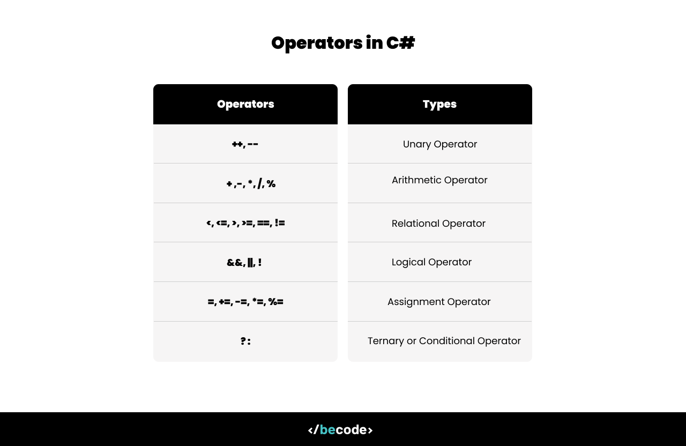

# 5. Operators



Operations in many softwares development are important, let us have a look.

- Unary Operators
- Arithmetic Operators
- Relational Operators
- Logical Operators
- Assignment Operators
- Conditional Operator

## Arithmetic Operators

- Addition : The operators "+" add two operands. For example: x + y
- Substraction : The operators "-"" substract two operands. For example: x - y
- Multiplication : The operators "_" multiply two operands. For example: x _ y
- Division : The operators "\*" divice two operands. For example: x / y
- Modulo : The ‘%’ operator returns the remainder when first operand is divided by the second. For example, x % y

## Relational Operators

- Equal to **(==)**: Checks if two operands are equal

- Not equal to **(!=)**: Checks if two operands are not equal.

- Greater than **(>)**: Checks if the first operand is greater than the second.

- Less than **(<)**: Checks if the first operand is less than the second.

- Greater than or equal to **(>=)**: Checks if the first operand is greater than or equal to the second.

- Less than or equal to **(<=)**: Checks if the first operand is less than or equal to the second.

```csharp
int x = 5, y = 5;
bool isEqual = x == y; // true
bool isNotEqual = x != y; // false
bool isGreater = x > y; // false
bool isLess = x < y; // false
bool isGreaterOrEqual = x >= y; // true
bool isLessOrEqual = x <= y; // true
```

## Logical Operators

- Logical AND (&&): Returns true if both operands are true.

- Logical OR (||): Returns true if at least one of the operands is true.

- Logical NOT (!): Reverses the logical state of its operand.

```csharp
int x = 10, y = 20;
int z = 5, w = 5;
bool result = (x > y) && (a < b); // false
bool result = (x > y) || (z < w); // true
bool result = !(x > y); // true
```

## Assignement Operators

### Simple Assignement (=)

- Simple Assignment (=): Assigns a value to a variable.
- Add Assignment (+=): Adds the right operand to the left operand and assigns the result to the left operand.
- Subtract Assignment (-=): Subtracts the right operand from the left operand and assigns the result to the left operand.
- Multiply Assignment (\*=): Multiplies the left operand by the right operand and assigns the result to the left operand.
- Divide Assignment (/=): Divides the left operand by the right operand and assigns the result to the left operand.
- Modulo Assignment (%=): Takes the modulus using two operands and assigns the result to the left operand.

```csharp
int x = 10; // Simple assignement (+)
int y = 5;

x = x + y; // or x += y
x = x - y: // or x -= y
x = x * y // or x *= y
x = x / y // or x /= y
x = x % y // or x %= y
```

## Conditional Operators

```csharp
int x = 10, y = 20, result;
result = x > y ? x : y;
Console.WriteLine(result);
```

## Exercices

For all the following exercies, please don't use `if/else` statement.

### Good to know!

#### Interpolation

```csharp
// $ Interpolation
int age = 34;
Console.WriteLine($"You are { age }");
```

#### Get the user's input.

```csharp
// $ Interpolation
int x = int.Parse(Console.ReadLine());
```

### 1. Are you an adult or a child?

Create a program that asks the user for their age and determines whether the user is an adult or a child.

- Hint: Use int.Parse() to convert the user's input from a string to an integer.

```csharp
[Test]
public void Test_IsAdult()
{
    int age = 22;

    string expected = "You are an adult";

    string result = Operators.Solution.IsAdult(age);

    Assert.That(result, Is.EqualTo(expected));
}

[Test]
public void Test_isChild()
{
    int age = 17;

    string expected = "You are a child";

    string result = Operators.Solution.IsAdult(age);

    Assert.That(result, Is.EqualTo(expected));
}
```

### 2. Even Or Odd

Create a program that determines whether a given number is Even or Odd.

```csharp

[Test]
public void Test_Even()
{
    int number = 102;
    string result = "Even";

    Assert.That(Operators.Solution.EvenOrOdd(number), Is.EqualTo(result));
}

[Test]
public void Test_Odd()
{
    int number = 43;
    string result = "Odd";

    Assert.That(Operators.Solution.EvenOrOdd(number), Is.EqualTo(result));
}
```

### 3. Add x to a number

Create a program that adds the second number to the first one.

```csharp
 [Test]
 public void Test_Add()
 {
     int number = Operators.Solution.Add(1,5);
     int result = 6;

     Assert.That(number, Is.EqualTo(result));
 }
```

### 4. Max

Create a program that asks for two numbers and determines which one is the maximum.

```csharp
[Test]
 public void Test_Max()
 {
    Assert.That(Operators.Solution.Max(2, 5), Is.EqualTo(5));
 }
```


